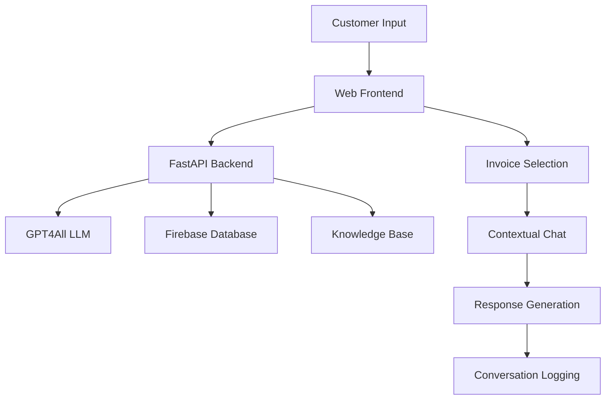

# KlarBill 🔋⚡
**Agentic AI for Smarter Utility Bill Communication**

> Transforming complex German utility bills into simple conversations through intelligent AI assistance.

## 🎯 Overview

KlarBill is an intelligent conversational AI assistant designed to help customers understand their complex German utility bills. Built for municipal utilities and energy providers, it reduces customer service burden while improving customer satisfaction through natural language interactions in German and English.

## ✨ Key Features

- **🗣️ Multilingual Support**: Native German and English responses
- **🎯 Personalized Greetings**: Customer-specific welcome messages
- **🔍 Smart Bill Analysis**: Deep understanding of German utility billing structures
- **📊 Cost Breakdowns**: Clear explanations of charges, taxes, and fees
- **💡 Contextual Responses**: Adapts answers based on query complexity
- **📝 Conversation Logging**: Complete audit trail for customer interactions
- **🔧 Easy Integration**: RESTful API for seamless Wilken software integration

## 🚀 Quick Start

### Prerequisites
```bash
# Python 3.9+
python --version

# Node.js (for frontend)
node --version
```

### Installation

```bash
# Clone repository
git clone https://github.com/your-org/klarbill.git
cd klarbill

# Backend setup
cd backend
pip install -r requirements.txt

# Download LLM model
mkdir models
# Place mistral-7b-instruct-v0.1.Q4_0.gguf in models/

# Frontend setup
cd ../frontend
# Serve with any web server
python -m http.server 8080
```

### Configuration

```bash
# Create .env file in backend/
FIREBASE_DATABASE_URL=your_firebase_url
FIREBASE_CREDENTIALS_PATH=path/to/credentials.json
```

### Running the Application

```bash
# Start backend
cd backend
python app.py

# Access frontend
# Open http://localhost:8080 in browser
```

## 📱 Usage Flow

### 1. Customer Identification
```
Customer enters → Customer/Invoice Number → System validates → Personalizes experience
```

### 2. Query Processing
```
Customer question → AI analyzes intent → Retrieves relevant data → Generates contextual response
```

### 3. Conversation Types

**Navigation Help**
- "Where can I find my consumption on the invoice?"
- "Wo finde ich meinen Verbrauch auf der Rechnung?"

**Consumption Questions**
- "How much energy did I consume this month?"
- "Wie viel Energie habe ich diesen Monat verbraucht?"

**Cost Breakdowns**
- "Can you explain my electricity charges?"
- "Können Sie meine Stromkosten aufschlüsseln?"

**Regulatory Information**
- "What is Konzessionsabgabe?"
- "Was ist die Konzessionsabgabe?"

## 🏗️ System Architecture



### Core Components

**Frontend (`/frontend`)**
- Vanilla HTML/CSS/JavaScript
- Responsive design with dark/light themes
- Language toggle (EN/DE)
- Real-time chat interface

**Backend (`/backend`)**
- FastAPI web framework
- GPT4All local LLM integration
- Firebase real-time database
- RESTful API endpoints

**AI Engine (`agentic_llm_service.py`)**
- Intelligent query classification
- Contextual response generation
- German energy regulation knowledge
- Multi-language support

## 🛠️ Technical Specifications

### Backend Stack
- **Framework**: FastAPI 0.68+
- **AI Model**: GPT4All (Mistral 7B Instruct Q4_0)
- **Database**: Firebase Realtime Database
- **Language**: Python 3.9+
- **Authentication**: Firebase Auth

### Frontend Stack
- **Languages**: HTML5, CSS3, JavaScript (ES6+)
- **Styling**: Custom CSS with CSS Grid/Flexbox
- **Icons**: Custom SVG graphics
- **Responsive**: Mobile-first design

### AI Model Details
- **Model**: Mistral 7B Instruct v0.1 (Quantized Q4_0)
- **Size**: ~4.1GB
- **Context Window**: 8,192 tokens
- **Response Time**: 2-5 seconds average
- **Languages**: German, English

### Data Processing
- **Invoice Format**: XML/JSON structured data
- **Customer Data**: Encrypted Firebase storage
- **Logging**: Timestamped conversation history
- **Analytics**: Query classification and response metrics

## 🔗 API Endpoints

### Core Endpoints

```http
POST /validate_identifier
Content-Type: application/json

{
  "identifier": "INV001234",
  "language": "en"
}
```

```http
POST /chat
Content-Type: application/json

{
  "message": "How much is my total bill?",
  "language": "en",
  "customer_number": "10000593",
  "invoice_number": "SWLS0074462025"
}
```

```http
POST /customer_name
Content-Type: application/json

{
  "customer_number": "10000593",
  "language": "de"
}
```

### Response Format

```json
{
  "response": "Your total bill amount is €1,156.80 for the period from 01.02.2025 to 31.01.2026.",
  "structured": {
    "customer_name": "Ulrike Bauer",
    "consumption": 2999,
    "invoice_amount": 1156.80,
    "query_type": "simple_fact"
  },
  "needs_invoice_number": false
}
```

## 🎯 Target User Segments

**Primary Users**
- **Young Adults**: Tech-savvy but unfamiliar with utility billing complexity
- **Non-Native Speakers**: Need clear explanations in preferred language
- **Technology-Oriented Customers**: Expect modern, efficient self-service options

**Secondary Users**
- **Elderly Customers**: Future voice integration for accessibility
- **Small Business Owners**: Commercial billing inquiries

## 📊 Value Creation

### For Customers
- **Instant Answers**: 24/7 availability for bill inquiries
- **Language Choice**: Native German or English support
- **Clear Explanations**: Complex billing made simple
- **Self-Service**: Reduce dependency on phone support

### For Utilities
- **Cost Reduction**: Fewer support tickets (estimated 40-60% reduction)
- **Efficiency**: Faster resolution times
- **Satisfaction**: Improved customer experience metrics
- **Scalability**: Handle peak inquiry volumes without additional staff

### For Wilken
- **Product Enhancement**: Add AI capabilities to existing software suite
- **Competitive Advantage**: Conversational billing AI with Agentic properties
- **Revenue Growth**: New product licensing opportunities
- **Customer Retention**: Increased value proposition

## 🔮 Future Roadmap

### Phase 1: Voice Integration (aTrain & Coqui TTS)
- Speech-to-text input processing
- Text-to-speech response output
- Accessibility improvements for elderly users
- Hands-free bill navigation

### Phase 2: Advanced Analytics
- Customer behavior insights
- Predictive query handling
- Personalized energy saving recommendations
- Billing trend analysis

### Phase 3: Mobile Integration
- Native mobile applications
- Push notifications for bill updates
- Offline capability for basic queries
- Integration with utility mobile apps

## 🧪 Testing & Quality

### Test Coverage
- Unit tests for core AI logic
- Integration tests for API endpoints
- End-to-end testing for user flows
- Performance testing for response times

### Quality Metrics
- **Response Accuracy**: >95% for factual queries
- **Response Time**: <8 seconds average
- **Customer Satisfaction**: Target NPS >8.5
- **First Contact Resolution**: >75%

### Development Setup

```bash
# Create development environment
python -m venv venv
source venv/bin/activate  # Linux/Mac
# or
venv\Scripts\activate     # Windows

# Install development dependencies
pip install -r requirements-dev.txt

# Run tests
pytest tests/

# Code formatting
black backend/
flake8 backend/
```

## 📄 License

This project is licensed under the MIT License

## 📞 Support

For technical support or questions:
- **Email**: support@klarbill.dev
---

**Built with ❤️ for better customer communication in the energy sector**
